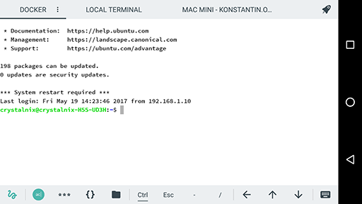
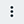

# Terminal Tabs
###### [[Termius Documentation](../../README.md) > [Android](../README.md) > [Features and functionality](README.md)]

Termius on Android features `Terminal Tabs`. **Terminal tabs is a Premium feature**, it a useful tool that helps you to navigate between active sessions. Terminal tabs appear on top of the Terminal window by tapping the Terminal once.

`Terminal tabs` features the Active sessions, the Quick Connect button, Session indicator and Session options.

###### *!* Swipe horizontally to hop between sessions

## Quick Connect

Tap the Rocket ship Shaped button to open the `Quick Connect` panel. Here you'll find a search option to search through existing hosts, the hosts you use frequently, the `Local Terminal` and `DNS Service Discovery`.

## Session options

The three vertical dots right to the Session name opens the Session options.

You may:
- Clone (duplicate) the selected sessions
- Alter the session Color scheme
- Change the session title, or
- Close the session

###### [[Go Back](../README.md)]
