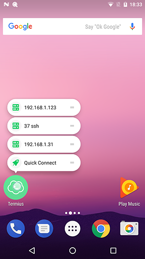

# Working with Termius
###### [[Termius Documentation](../../README.md) > [Android](../README.md) > [Quick start](README.md)]

The Termius UI is packed with tons of features to improve your workflow.

### In this document
* [Shortcuts](#shortcuts)
* [Terminal tabs](#terminal-tabs)
* [Extended keyboard](#extended-keyboard)
* [Paste password](paste-password)
* [Autocomplete](#autocomplete)
* [History](#history)

## Shortcuts
Shortcuts is a feature available on Android 7+ devices, with shortcuts you may directly tap into a host straight your device homescreen. You also may designate dedicated shortcuts.

Shortcuts work by tapping and holding the Termius icon. A menu with frequently used hosts pops up. By holding the double lined icon on the right of each option you may create a dedicated shortcut of that particular host.

## Terminal tabs
Terminal tabs lets you jump between active sessions quickly.

Active sessions appear at the top of the screen, by swiping horizontally you may switch between them. By tapping the three vertically oriented dots you may alter each individual tap.

Read a more detailed description [here](../features/terminal_tabs.md). *!missing link*

## Extended keyboard
The extended keyboard adds a number of unique features and keys that are otherwise hard to find to the Android keyboard. The additional keys are grouped in customizable key groups.

The extended keyboard itself is customizable by tapping the `...` dotted icon...

###### [[Go Back](README.md)]
