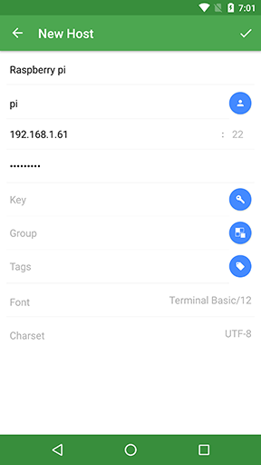

## Add a basic host

The `Hosts` screen is the first screen that will appear when you'll open the app for the first time. It shows a big blue `+` on the bottom right corner and sais `Hosts` on the top left.

> #####***!*** What is a host?
> Serverauditor is a cross-platform SSH Client. It helps you to connect to- and manage a system or service. If a system or service is prepared to accept SSH connections it is called a host. A host can be found through hostname e.g. ssh.serverauditor.com or IP address e.g. 192.168.0.21. 

To get started with Serverauditor we should add a 'host'. This is done in the Hosts screen.
* Tap the blue `+`
* Them tap `New Host`

A new screen will appear titled `New Host`
* Enter an alias; Raspberry Pi, for example
* Enter an IP address or hostname under `hostname`
* Fill out the username and password
* And hit the tick `✓` in the top right corner 

> ***!*** IP address, hostname, and credentials are unique to the host you connect with.

## Connect to a host

After tapping the tick, you'll be sent back to the `Hosts` screen. Here you should see the freshly entered host. To connect **tap it once**. 

You may see a [security warning](http://www.lysium.de/blog/index.php?/archives/186-How-to-get-ssh-server-fingerprint-information.html). Don’t worry: everything is fine. Hit `Connect`. You’ll only see this warning the first time Serverauditor connects to a host that it hasn’t seen before.

Now a terminal with a prompt should appear, you are connected. Type exit to close the terminal window.

> #####***!*** Troubleshooting
> If a dialogue saying `Connection failed Connecting to xxx.xxx.xxx.xxx port 22` appears, it is likely you have entered an incorrect IP address. Otherwise, you device might not be hooked up to a network, the host might be turned off, or it may be in a different network than your device.
