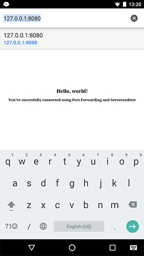
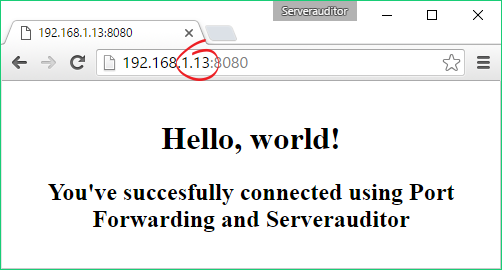
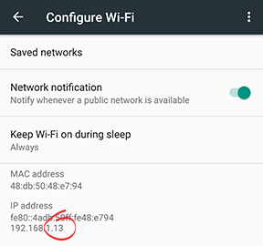

## Port forwarding
Sometimes you may want to connect to a host or service that is not directly available, for instance, a MySQL database that resides on a web server. In such scenario and dozen others, connecting may require Port forwarding. In our example, we'll set up a connection to a [simple web app](https://docs.djangoproject.com/en/dev/intro/tutorial01/) on Raspberry pi through your mobile device.

> #####*!* What is Port forwarding?
> Port forwarding is used to redirect a communication request from one address and port number to another while packets are traversing a network gateway, such as a router or firewall. In layman terms, Port forwarding helps a packet to find its destination through a complex network.

### In this document
* [How to setup Port forwarding](#how-to-setup-port-forwarding)
* [Variation in settings](#variation-in-settings)
* [Web Resources and Tutorials](#web-resources-and-tutorials)

## How to setup Port forwarding
Given that the web app is up and running. We'll use the same host we have set up [before](basic_host.md) with the alias 'Raspberry Pi'. Make sure the connection works. To setup port forwarding we're going to create a new rule.

* Open the menu by tapping the three horizontal lines in the lop left corner
* Navigate to `Port forwarding`
* Hit the blue `+`, now a new window named `New Rule` opens
* And fill out the following
	* `Type` 'Local'
	* `Host from` 'Raspberry pi'
	* `Port from` '8080' 
	* `Host to` '127.0.0.1' 
	* `Port to` '8000'
	* `Address` '0.0.0.0'
* Finally hit the tick `✓` in the top right corner 

> ##### _!_ Note that the host's IP may have been changed
Your Raspberry pi may use a dynamic IP address. This means that the IP address may differ after each reboot. [Update](basic_host.md#edit-or-delete-a-host) the host in such case

Now you'll be sent back to the `Port forwarding` screen. Here tap the new rule, the icon should turn blue. The rule is now in effect. To connect to the web app, open a browser and go to http://127.0.0.1:8080

> ##### _!_ So how does this work?
Serverauditor redirects all traffic that connects to Localhost on port 8080 to your Raspberry pi over port 8000. This is done through an SSH tunnel, virtually tricking the Pi into believing that you're connecting through 'Localhost'. Finally, by setting the Address to 0.0.0.0 you'll tell your device that all connections are allowed to pass through.

## Variation in settings

### The type of connection 
`Local`, `Remote`, and `Dynamic` determine the 'direction' of the SSH tunnel. Local port forwarding is the most common type. It creates a tunnel from the device you're using to the service you want to connect with. With remote port forwarding, you'll be able to create an SSH tunnel from a remote server to your device, allowing access to your device. Dynamic port forwarding allows network traffic to travel two ways.

### Host from and port from
Here you fill out the intermediate server and the port. 

### Host to and port to
Here you fill out the targeted address and port.

### Address
Fill out 127.0.0.1 to allow the device that is carrying Serverauditor access to the host. To allow access through a specific device you'll fill out its IP address. And use 0.0.0.0 to allow all devices in a network access.

 &nbsp; 

> ***!*** If you've set `Address` with 0.0.0.0 you'll be able to tunnel into the web app using any device in the same network. Use the IP address of your mobile device and the correct port to do so. For instance http://192.168.1.13:8080 

## Web Resources and Tutorials
* [What is port forwarding](http://blog.trackets.com/2014/05/17/ssh-tunnel-local-and-remote-port-forwarding-explained-with-examples.html)
* [How to install Django](https://docs.djangoproject.com/en/dev/intro/install/)
* [How to build a Django web app](https://docs.djangoproject.com/en/dev/intro/tutorial01/)
* [A web server with Raspberry pi](http://raspberrypituts.com/django-raspberry-pi-tutorial/)