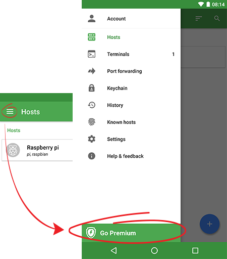
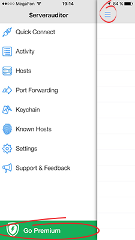

# How do I get a Premium subscription?
###### [[Termius Documentation](../../../README.md) > [General](../../README.md) > [FAQ](../README.md) > [Premium Subscriptions](README.md)] 

Users may obtain a Premium subscription in-app by clicking the `Go Premium` button in the menu or under the account settings.

### Android

### iOS

###### [[Go Back](README.md)]
