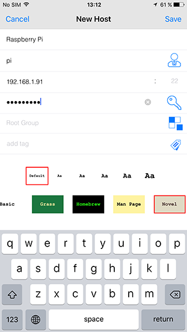
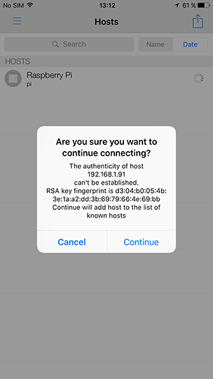
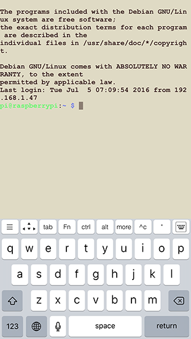

# Work with a basic host
###### [[Termius Documentation](../../README.md) > [iOS](../README.md) > [Quick start](README.md)]

To start a session, the user needs to setup a host, this is done in the `Hosts` screen. In our example we'll be connecting to a Raspberry pi in our local network.

### In this document
* [Add a basic host](#add-a-basic-host)
* [Connect to a host](#connect-to-a-host)
* [Edit or delete a host](#edit-or-delete-a-host)

## Add a basic host

Make sure you're in the `home` screen. The `Home` screen is the first screen that will appear when you'll open the app for the first time. Now, follow the instructions on the screen, `start by adding a new host`. Tap `New Host` and a new window will pop up.

> ***!*** If you run Termius for the first time, a prompt asking you to allow notifications will pop up, click ‘Allow’ (recommended).

Enter an `alias`, this could be ‘Raspberry Pi’, for example. Then enter the IP address under `hostname`. Fill out the `username` and `password` and hit ‘save’ in the top right corner.

> ***!*** IP address, hostname, and credentials are unique to the host you connect with.

&nbsp;

> ***!*** What is a host?
> Termius is a cross-platform SSH Client. It helps you to connect to- and manage a system or service. If a system or service is prepared to accept SSH connections it is called a host. A host can be found through hostname e.g. ssh.Termius.com or IP address e.g. 192.168.0.21.

## Connect to a host

After you’ve saved the new host, you’ll be sent back to the `Hosts` screen. Otherwise, make sure you're in the `Hosts` screen. Here you’ll find the new entry.

Tap the host you'd like to connect to once, when the connection works you’ll see a [security warning](http://www.lysium.de/blog/index.php?/archives/186-How-to-get-ssh-server-fingerprint-information.html). Don’t worry, everything is fine, click ‘Continue’. You’ll only see this warning the first time Termius connects to a Pi that it hasn’t seen before.

Now a terminal with a prompt should appear, you are connected. Type exit to close the terminal window.

> **!** You can type `exit` to close the terminal window.

 

> ###Troubleshooting
> In case a red exclamation mark will appear, something went wrong. Tap the exclamation mark for the error description. ‘Connection establishment time out.’  means you’ve most likely entered a wrong IP address. Otherwise, you device might not be hooked up to a network, the host might be turned off, or it may be in a different network than your device.

## Edit or delete a host
A connection might be unsuccessful due to various reasons. For instance, you might have made a typo, or the IP address or credentials have changed. In such case, you need to update the host.

To do so, on the `Hosts` screen, swipe the particular host to the left, and new functions will appear. Tap edit. A new screen titled `Edit Host` will pop up.

###### [[Go Back](README.md)]
