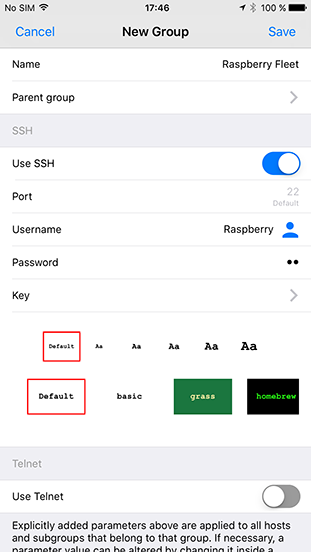
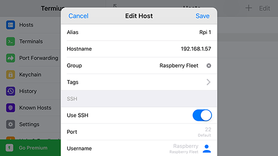
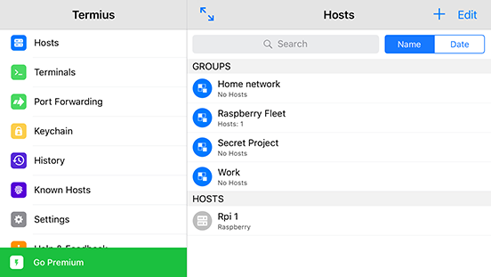

# Work with host groups
###### [[Termius Documentation](../../README.md) > [iOS](../README.md) > [Quick start](README.md)]

A clever way to manage multiple hosts is through host `Groups`. With these `Groups` you can collect similar hosts, and manage shared settings in a single action. In our example, we'll be setting up a Raspberry pi fleet in our local network.

### In this document
* [Create a host group](#create-a-host-group)
* [Add hosts to a group](#add-hosts-to-a-group)
* [Manage groups](#manage-groups)

## Create a host group
Make sure you are in the `Hosts` screen.

To add a host group
* Hit the big blue `+` on the top right of the screen.
* Now tap `New Group`

A screen titled `New Group` appears. Here we will fill out the data that our hosts inside the group will have in common. Leave host-specific fields blank.

* Start with the group name; 'Raspberry Fleet' for instance
* Select the protocol you want to use, SSH or Telnet (We select SSH)
* Enter the username, password or key
* You may set up a parent group, and default template as well
* And hit `Save` in the top right corner

> ***!*** Group settings correspond to individual settings of subordinate hosts. When a group setting is changed host settings are automatically changed as well. Note, however, that individual settings overrule group settings

## Add hosts to a group

To add a host to a group you need to change the group field inside the host's configuration.

To add a host to a group by **changing its** `Group` **field value**,
* add a host using the blue `+`
* Before entering any details, tap the `Group` field
* Navigate to the correct group, 'Raspberry Fleet' in our case
* And hit the tick `✓` in the top right corner

You will notice that several fields now are filled out automatically. Continue like you would when [adding a basic host](basic_host.md).

## Manage groups

Groups can be organized in subgroups. Subordinate groups adopt the settings of the primary group. Note, however, that individual group settings overrule primary group settings.

All groups appear in the host screen. A group can be edited and one or more selected groups can be removed with a long press.

> ***!*** Note that when deleting a group, all subordinate groups and hosts will be deleted as well!

###### [[Go Back](README.md)]
